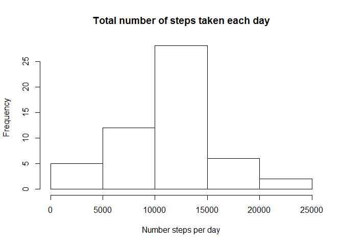
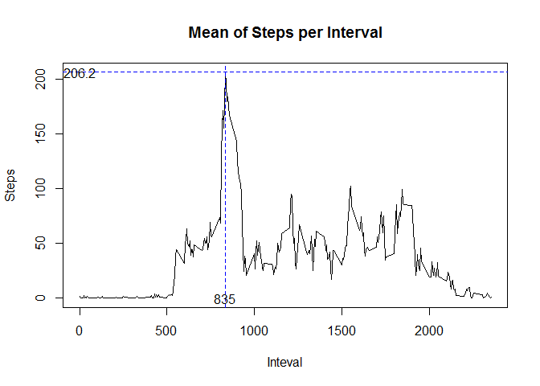
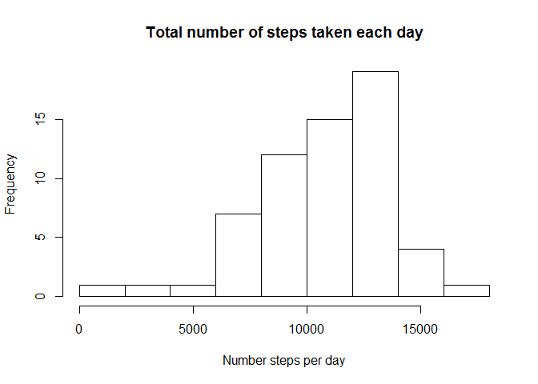
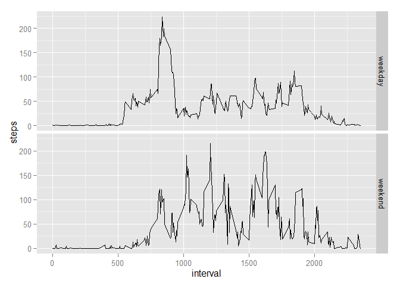

# Reproducible Research: Peer Assessment 1


## Loading and preprocessing the data

Read and process of the data.

```r
library(ggplot2)
library(knitr)
dataPrin <- read.csv(
  'activity.csv', colClasses = c('integer','Date','integer')
)
```

## What is mean total number of steps taken per day?


```r
dataPrinGroup <- aggregate(
  list(steps = dataPrin$steps), 
  by = list(date = dataPrin$date) ,FUN=sum
)
hist(dataPrinGroup$steps, 
     main="Total number of steps taken each day",
     xlab = 'Number steps per day'
)
```

 

The next is a table with the mean and median.


```r
kable(data.frame(
  median=median(dataPrinGroup$steps, na.rm = T), 
  mean=mean(dataPrinGroup$steps, na.rm = T)
))
```


 median       mean
-------  ---------
  10765   10766.19

## What is the average daily activity pattern?


```r
dataPrinGroupInterval <- aggregate(
  list(steps = dataPrin$steps), 
  by = list(interval = dataPrin$interval) ,FUN=mean,
  na.rm = T
)
maxSteps <- subset(dataPrinGroupInterval,
  steps==max(dataPrinGroupInterval$steps)
)

plot(
  x = dataPrinGroupInterval$interval,
  dataPrinGroupInterval$steps, type="l",
  main = "Mean of Steps per Interval",
  xlab = "Inteval", ylab = "Steps"
)
abline(v = maxSteps$interval, col = "blue", lty=2)+
abline(h = maxSteps$steps, col = "blue", lty=2)+
text(maxSteps$interval,0,maxSteps$interval)+
text(0,maxSteps$steps,round(maxSteps$steps,1))
```

 

We can see that the interval with most steps average is 835 with 206.2 steps.

## Imputing missing values

The procces that I choose to fill the missing data is looking for the median per day in the same month.

```r
newData <- dataPrin
newData$nameD <- weekdays(as.Date(newData$date))
newData$id = seq(nrow(newData))
newData$nDay <- weekdays(newData$date)
newData$nMonth <- months(newData$date)

dataNA <- newData[is.na(newData$steps),]
for(reg in 1:nrow(dataNA)){
  dataTemp <- subset(newData, 
    nMonth == dataNA[reg,]$nMonth & nDay == dataNA[reg,]$nDay & 
    interval == dataNA[reg,]$interval 
  )
  newData[newData$id %in% dataTemp$id,'steps']<-mean(dataTemp$steps, na.rm = T)
}
```

The missing rows are `R nrow(dataNA)` but after the process is of `R sum(is.na(newData$steps))`


```r
dataPrinGroup2 <- aggregate(
  list(steps = newData$steps), 
  by = list(date = newData$date) ,FUN=sum
)
hist(dataPrinGroup2$steps, 
     main="Total number of steps taken each day",
     xlab = 'Number steps per day'
)
```

 
We can see the new meadian and mean.


```r
kable(data.frame(
  median=median(newData$steps, na.rm = T), 
  mean=mean(newData$steps, na.rm = T)
))
```


 median       mean
-------  ---------
      0   37.59433


## Are there differences in activity patterns between weekdays and weekends?

```r
newData$lapsus <- ''
newData[newData$nameD %in% c('sabado','domingo'),]$lapsus <- 'weekend'
newData[newData$lapsus =='',]$lapsus <- 'weekday'
newData$lapsus <- as.factor(newData$lapsus)

dataPrinGroupByInterval2 <- aggregate(
    list(steps = newData$steps), 
    by = list(lapsus = newData$lapsus, interval = newData$interval) ,FUN=mean
)
ggplot(data = dataPrinGroupByInterval2, aes(interval, steps, group = lapsus))+
  geom_line()+
    facet_grid(lapsus~.)
```

 
